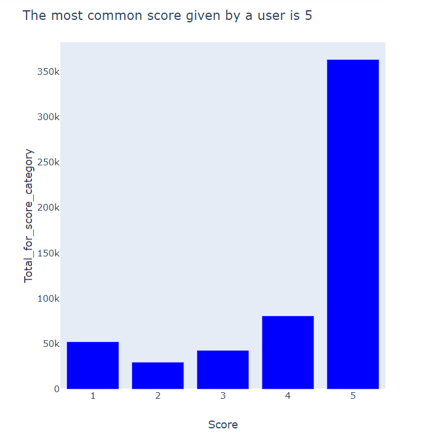

# User-based-collaborative-filtering
Building and testing of a recommender system using a user based collaborative filtering technique.
## Project title: Building and testing of a recommender system using a user based collaborative filtering technique.

### Author: [Tola Ogunniyi](https://www.linkedin.com/in/tolaogunniyi/)
----

### Date completed: April 11, 2020.

### Introduction:
One of the biggest challenge every E-commerce business faces is knowing what products to recommend to customers. This is very crucial 
because recommending the right product(s) helps to increase customer retention, trust and profit generation. There are different types of 
recommender systems and the one explored in this project is a user-based collaborative filtering technique.This recommends items that 
similar users have also liked i.e. predicting unknown ratings by using similarities between users.

### Dataset
I used an Amazon fine-food-reviews dataset that I found on [Kaggle](https://www.kaggle.com/snap/amazon-fine-food-reviews).

----
### Jupyter notebook 
The project was completed using a jupyter notebook that consists of 2 parts viz:

Part 1: 
 (i) Preprocessing and cleaning (ii) Exploratory data analysis

Part 2:
 Modeliing
 ----
 ### Visualizations in the dataset
There are three figures provided. These are visualizations created in the exploratory data analysis (section ii) of Part 1. All three 
visualizations were created using Plotly express. The charts have also been included as an image file with links attached.A summary of the each chart is provided below:

 Figure 1-Distribution of Scores for Amazon fine food reviews

  

### References
- https://towardsdatascience.com/building-and-testing-recommender-systems-with-surprise-step-by-step-d4ba702ef80b

### Future work based on the dataset
 - Next step would be to explore the dataset with an item-based collaborative filtering techniques and also deep learning 
 to help in comparing the different models to see which performs the best.
---

<strong>Thank you very much for taking the time to look at this project. Please feel free to contact me via 
email(tola.ogunniyi1@gmail.com) or [linkedIn](https://www.linkedin.com/in/tolaogunniyi/) if you have any 
questions,comments or feedback</strong>
